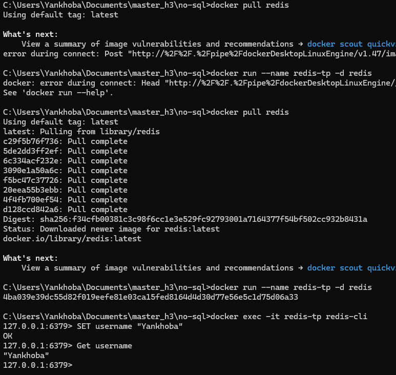
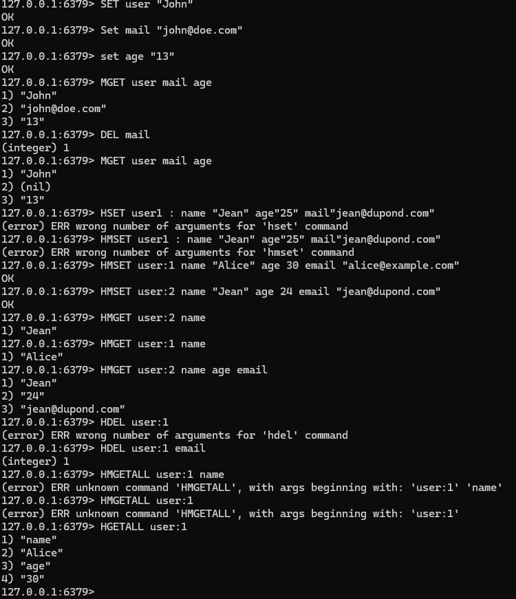
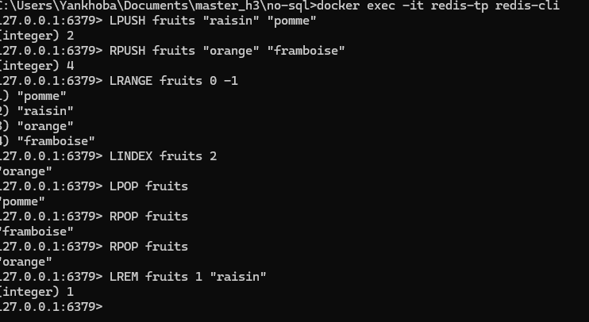

# TP Redis

Ce TP Redis avec Docker.

## Étapes à suivre

### 1. Installation de Redis avec Docker
- **Installation de Redis avec Docker** : Lancez la commande suivante :
    ```bash
    docker pull redis
    ```
- **Démarrage du conteneur** : Utilisez la commande suivante pour démarrer le conteneur :
    ```bash
    docker run --name redis-tp -d redis
    ```
- **Connexion au conteneur redis-tp** : Pour pouvoir intéragir avec mon conteneur et faire des opérations
    ```bash
    docker exec -it redis-tp redis-cli
    ```

- **Basic Create & Read String** : Pour pouvoir intéragir avec mon conteneur et faire des opérations
    ```bash
    Set user
    Set mail
    Set age
    Mget user mail age
    HMSET user:1 name "Alice" age 30 email "alice@example.com"
    ```


- **Basic Create, Read, Delete List** : Pour pouvoir intéragir avec mon conteneur et faire des opérations
    ```bash
    LPUSH fruits "Pomme" "Raisin"
    RPUSH fruits "Framboise" "Orange"
    LPOP fruits    
    RPOP fruits
    LREM fruits 1 "Raisin"    
    ```

